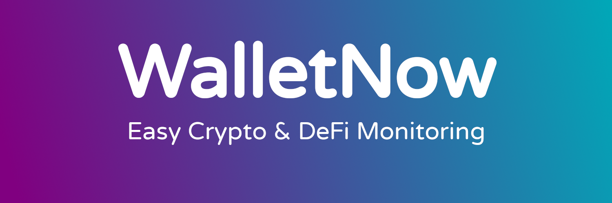

### WalletNow.net

WalletNow consolidates all your crypto investments from multiple sources and aggregates them in a simple, clean and searchable table. It has advanced features such as: Telegram Bot, Time Machine, Active Monitoring with notifications of important changes on your Portfolio, among many others

* **Open the app:** https://walletnow.net
* **Documentation:** https://docs.walletnow.net

This repository contains the source-code of our smart contracts and it is also used to track:
 - Our public roadmap (what are we working on right now?)
 - Issues (open an issue if you have a problem with WalletNow)
 - Feature requests

